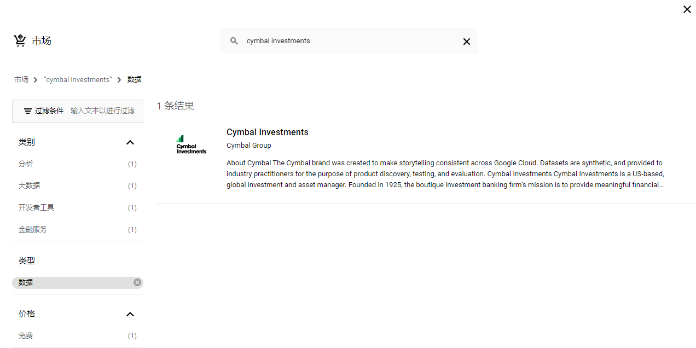

# Setup Instructions

1. Login to your Google account, and open [Google Cloud Console](https://console.cloud.google.com/).


2. Click on `My Project` button on the top left, select an existing project, or create a new project.


3. Once a project is selected, choose to run queries with BigQuery in the welcome page.


4. In the Explorer, click on `+ ADD`, scroll down and select `Public Datasets`.


5. Search for "Cymbal Investments", and click on the result displayed. In the product details page, click on `VIEW DATASET`.




6. There is a table named "trade_capture_report". Click on the actions icon on the right, and select `Query`, which opens a new SQL workspace tab, along with a sample query. Run the query by clicking on the `Run` button.

```sql
SELECT * FROM `bigquery-public-data.cymbal_investments.trade_capture_report` LIMIT 1000
```


7. Now you should be able to play around with the dataset, using the SQL queries provided in this repository.
